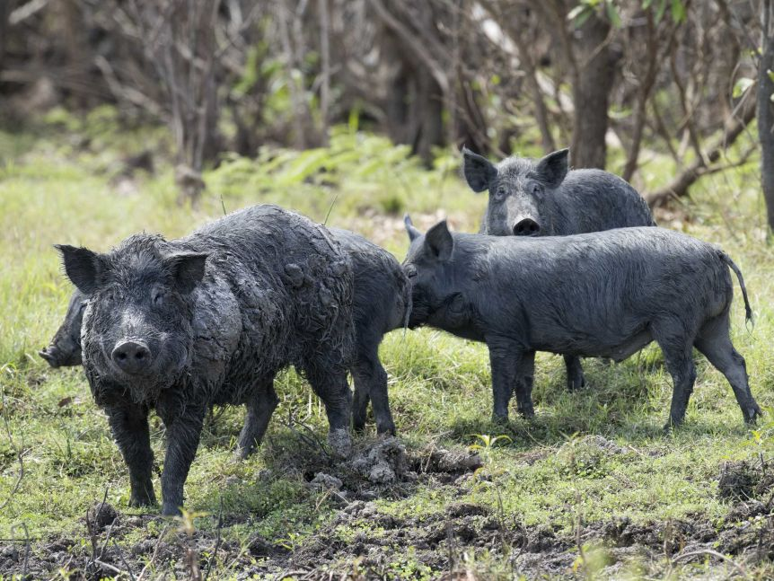
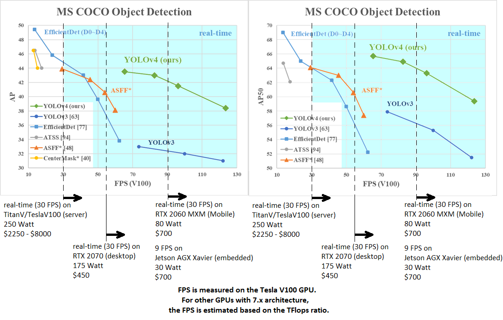
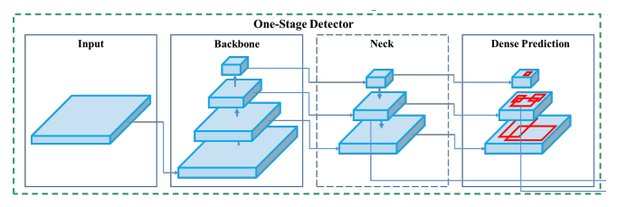
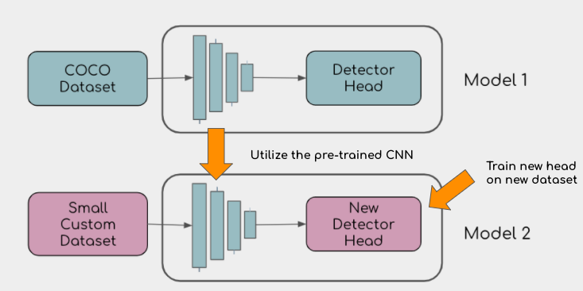
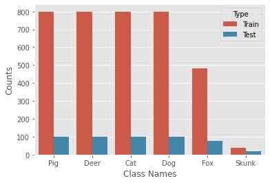
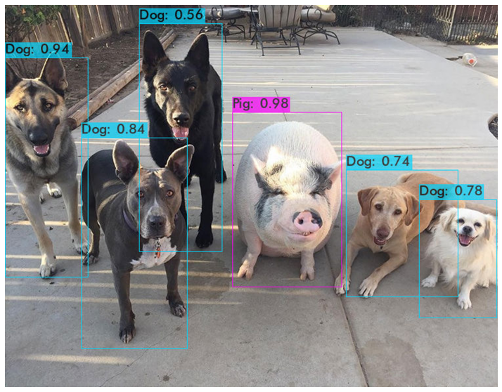

# Feral Hog Identification
### Transfer learning with an object detection model

 

## Overview

Feral pigs(a.k.a feral hogs, wild hogs, feral swine, razorbacks) are out of control.  In recent decades, feral pig numbers have grown to unmanageable levels, particularly in Texas.  They are widely considered to be the most destructive invasive species in the United States.  Feral hogs cause tremendous damage to crops, livestock, waterways, native plants, wildlife, and local eco-systems.  Their annual damage is estimated to be around 1.5 billion dollars annually.  2.6 million feral pigs reside in Texas, accounting for half of the total US population.  That population is exploding at an estimated 20% growth rate.  Mitigation and control efforts at the federal, state, and local levels has proven the issue to be extremely challenging. Farmers spend millions in efforts to protect their business and property from feral pigs.  It's not unheard of to lose tens of thousands of dollars in a single night due to the feral pigs destruction.  As AI and embedded device technologies mature and become more affordable, there is an opportunity to provide relief to those affected by feral pigs.  The goal of this project is to demonstrate the ability to deploy cutting-edge, scaleable object detection models, including tuning/training for a specific application, to quickly create solutions for my team and customers.

## Object Detection

Object detection is a computer vision technique used to locate and identify one or more objects in an image or video.  Object detection combines object localization and classification.  Whereas classification and localization works for only one object in a frame.  Object detection works for multiple objects as well as multiple instances of an object in a given image.  Various types of object detection algorithms exist today.  The top-preforming algorithms employ CNNs and Deep Neural Network architecture.
These models can 2 broken up in 2 broad categories:

 * Two-stage Detectors(region proposal based framework)
    More accurate than one-stage detectors.

 * One-step Detectors(regression based framework)
    More suitable for real-time applications as they are much faster and less computationally expensive than two-stage detectors.

## YOLOv4

I chose to utilize YOLOv4, a one-step detector, for this project. Though it is not accurate as some of the top preforming two-stage detectors, YOLOv4 can be trained on a single GPU and the model is much making it well-suited for real time applications.

 


YOLOv4 architecture is composed of 3 main parts:

 1. Backbone- CSPDarkNet53
 2. Neck- SSP, PAN
 3. Head- YOLOv3
 
  

## Transfer Learning/Fine Tuning
 
 
 Transfer learning is a machine learning technique where a model developed for one task is used as a starting point for developing a model for a second task.  For this project, we'll use the convolutional neural network(CSPDarknet53 backbone) and train only the head.

 The custom dataset was built by collecting ~4000 images in 6 animal classes from Googles Open Images Dataset then converting the image annotations into YOLO format.
 
 

## Results
 

### Feral Hog Detection Model
#### Mean Average Precision(Map) = 92.13%
##### Avg Loss after 4800 of 12000 iterations = 1.4


```calculation mAP (mean average precision)...
 Detection layer: 139 - type = 28 
 Detection layer: 150 - type = 28 
 Detection layer: 161 - type = 28 
496
 detections_count = 1265, unique_truth_count = 654  
class_id = 0, name = Pig, ap = 88.39%   	 (TP = 133, FP = 20) 
class_id = 1, name = Deer, ap = 91.27%   	 (TP = 153, FP = 13) 
class_id = 2, name = Fox, ap = 99.43%   	 (TP = 79, FP = 5) 
class_id = 3, name = Cat, ap = 98.32%   	 (TP = 104, FP = 5) 
class_id = 4, name = Skunk, ap = 80.65%   	 (TP = 14, FP = 2) 
class_id = 5, name = Dog, ap = 94.71%   	 (TP = 102, FP = 16) 

 for conf_thresh = 0.25, precision = 0.91, recall = 0.89, F1-score = 0.90 
 for conf_thresh = 0.25, TP = 585, FP = 61, FN = 69, average IoU = 76.59 % 

 IoU threshold = 50 %, used Area-Under-Curve for each unique Recall 
 mean average precision (mAP@0.50) = 0.921259, or 92.13 % 
Total Detection Time: 11 Seconds
```
* The Skunk class, unsurprisingly, had the lowest average precision(80.65%) of all classes as it was very imbalanced due to the lack of annotated skunk images in the Open Images dataset.  

### Real Time Detection
 

As you can see, though a bit unstable, the detector does seem to locate and identify pigs most of the time.  
A clip of video was converted to a GIF in order to render in this markdown file.  This GIF is very choppy. 

## Next Steps

* Continue training and improving the model.

* Build a custom dataset for feral pigs including common livestock and wildlife with an emphasis on infrared images. 

* Build a version of YOLO in TensorFlow for real-time detection through a mobile phone webcam. 


## Acknowledgements/References


[https://github.com/AlexeyAB/darknet](https://github.com/AlexeyAB/darknet)

[https://github.com/EscVM/OIDv4_ToolKit](https://github.com/EscVM/OIDv4_ToolKit)

[USDA Animal and Plant Health Inspection Service](https://www.aphis.usda.gov/aphis/ourfocus/wildlifedamage/operational-activities/feral-swine)

